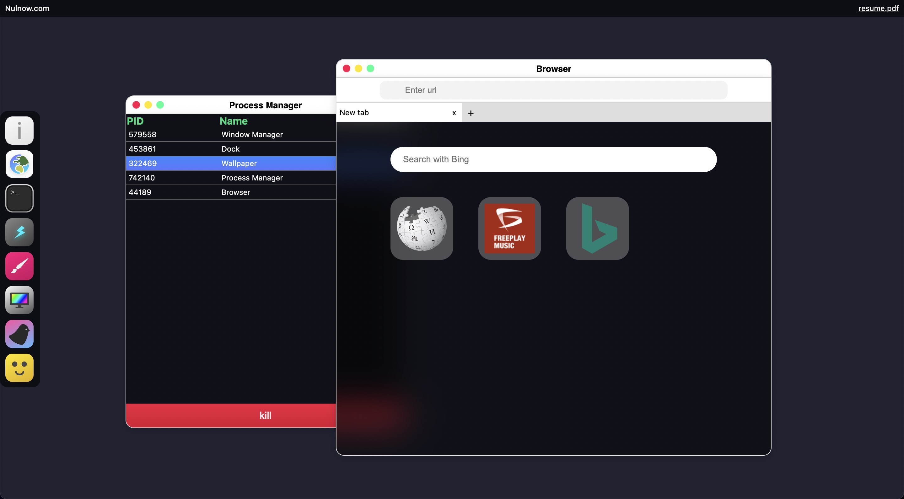

# MacOS Web React

Window system built with react

Visit [nulnow.com](http://nulnow.com)

## TODO
* Remove checking pointer events on iframe based apps because
it's unnecessary with new AppLayout update
the original document
* When enters `fullscreen` on `iframe based` apps the app size stays the same; app
does not exit `fullscreen` mode if use press `Escape` button
* Filesystem
* Desktop icons
* Move all iframe based apps to browser bookmarks and allow shortcuts
to open browser tabs so if user click on this shortcut browser will open
with provided url
